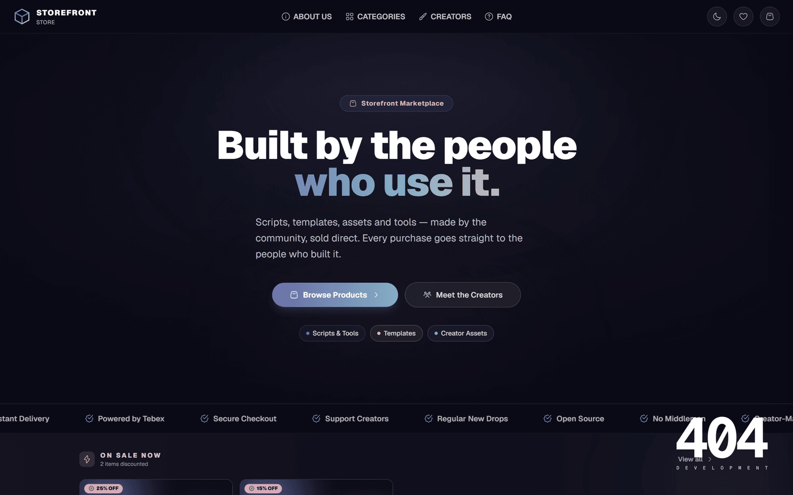
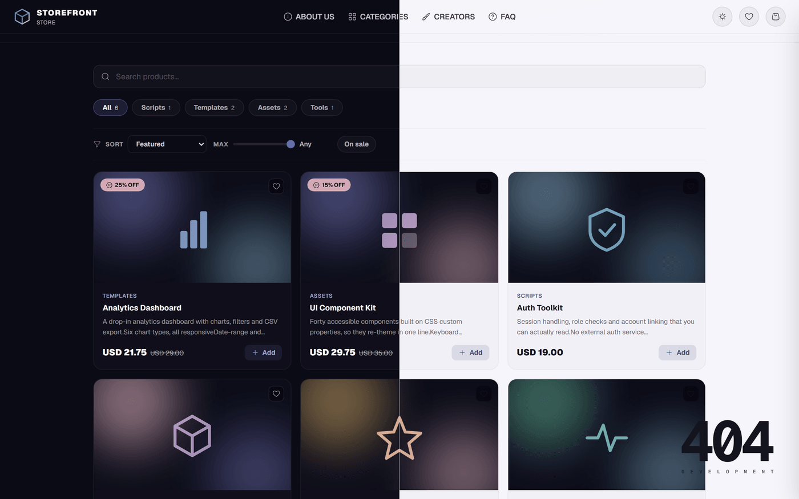
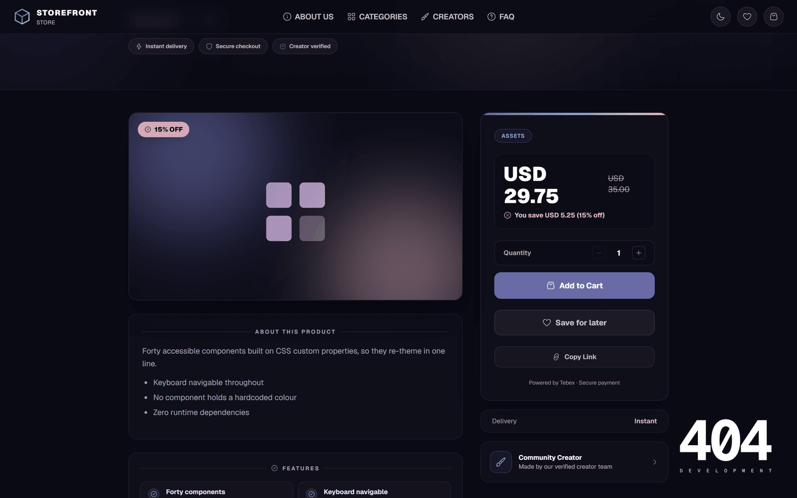
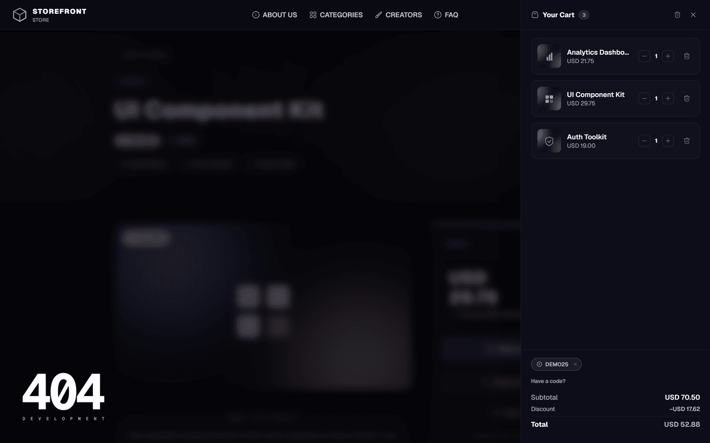
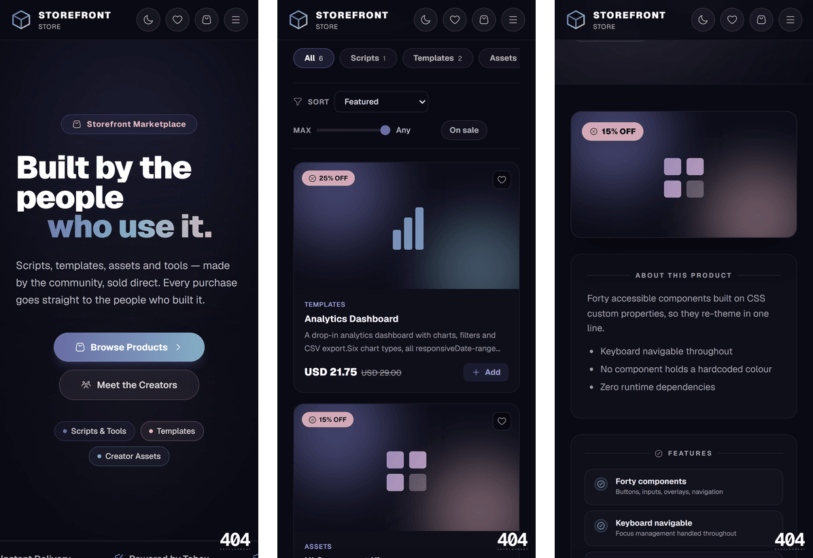

<div align="center">

# Headless Kit

**A complete storefront for the [Tebex Headless API](https://docs.tebex.io/developers/headless-api/overview).**
Point it at your Tebex store, edit one config file, deploy to Cloudflare Workers.

[**Live demo →**](https://headless-kit-demo.404dev.workers.dev)

[](https://nextjs.org)
[](https://react.dev)
[](https://tailwindcss.com)
[](https://workers.cloudflare.com)
[](./LICENSE)

Built by **[404 Development](https://404development.com)**

</div>



---

## What this is

Tebex gives you a hosted store page. The Headless API lets you build your own instead — but you're then on the hook for the catalogue, cart, account linking, checkout handoff and everything around it.

This is that part, finished. It's aimed at anyone selling through Tebex: game server communities (FiveM, Minecraft, Rust), asset creators, and anyone who wants a storefront that looks like theirs rather than like Tebex's.

**It runs before you configure anything.** `npm run demo:dev` gives you a working shop with a built-in catalogue, so you can click through the whole thing — cart, discount codes, filters, theming — before you have a token.

## Features

| | |
| --- | --- |
| **Catalogue** | Categories and subcategories, search, six sort orders, price cap, on-sale filter |
| **Cart** | Persistent basket, quantity steppers, optimistic updates, abandoned-cart nudge |
| **Discount codes** | Coupons, gift cards and **creator codes** — with the discount broken out in the totals |
| **Account linking** | Tebex's game-account flow, including finishing the add after the redirect back |
| **Save for later** | Wishlist and a recently-viewed rail, synced across browser tabs |
| **Reviews** | Star ratings and written reviews on Cloudflare D1 — optional, off by default |
| **Theming** | Light, dark and system. Nine tokens re-theme the entire store, logo included |
| **SEO** | Per-product metadata, social cards, `sitemap.xml` and `robots.txt` |
| **Accessibility** | Contrast audited to WCAG AA on the main flows, in both themes |

### Light and dark, from nine tokens



### Product pages



### Cart, with codes applied



### Responsive



---

## Quick start

Requires **Node 20.9+**.

```bash
git clone https://github.com/notcamslice/store.git headless-kit
cd headless-kit
npm install
npm run demo:dev
```

Open <http://localhost:3000> and you'll have a working storefront running on the built-in demo catalogue.

### Connecting your Tebex store

In the Tebex Creator Panel, open your store and go to **Store Settings → API Keys**. Copy the **public webstore token** — not a secret key.

```bash
cp .env.example .env.local
```

```ini
TEBEX_TOKEN=your-token-here
NEXT_PUBLIC_STORE_URL=http://localhost:3000
```

Then `npm run dev`. Without a token the app still runs and the production build still succeeds — the catalogue pages degrade to an empty state rather than crashing, and in development you get a setup screen telling you exactly what's missing.

---

## Making it yours

Almost everything brand-facing lives in two files.

### 1. `src/config/site.ts`

Name, tagline, description, social links, support email, legal entity, homepage stats. Anything left as an empty string is treated as "not configured" and hidden, rather than rendered as a dead link.

```ts
export const site = {
  name: "Storefront",
  tagline: "Built by the community.",
  socials: [{ platform: "discord", url: "" }],
  supportEmail: "support@example.com",
};
```

### 2. `src/app/globals.css` — the `@theme` block

The entire palette, as nine tokens:

```css
@theme {
  --color-brand: #6a6ba6;
  --color-brand-hover: #8384c8;
  --color-accent: #e5b5c1;
  --color-info: #83afc4;
  --color-surface: #0b0b16;
  --color-surface-raised: #0d0d1a;
  --color-surface-panel: #111125;
  --color-surface-elevated: #1a1a35;
  --color-fg: #ffffff;   /* ink: all text and hairline borders derive from this */
}
```

Change these and the whole store re-themes — including the logo, which is inline SVG referencing the same custom properties. No component holds a hardcoded colour.

Four ready-made palettes, with light-theme values for each, are in **[THEMES.md](./THEMES.md)**.

### Everything else

| What | Where |
| --- | --- |
| Logo mark | `src/components/logo.tsx` (inline SVG, themed) and `public/assets/logos/logo.svg` |
| Backgrounds | `public/assets/backgrounds/*.svg` |
| Social card image | `public/assets/og.png` (1200×630) |
| Creator roster | `src/config/creators.ts` — ships empty, renders an empty state until filled |
| Product features/requirements | `src/lib/products.json`, keyed by Tebex package ID |
| Terms & Privacy | `src/app/terms/`, `src/app/privacy/` — **placeholders, see below** |

> [!IMPORTANT]
> The Terms and Privacy pages are generic placeholders and are **not legal advice**. They haven't been reviewed for any jurisdiction. Replace them with terms describing what you actually sell and how you handle data, then delete `src/components/legal-template-notice.tsx` and its two usages.

---

## Deploying to Cloudflare Workers

```bash
npx wrangler login
npx wrangler secret put TEBEX_TOKEN
npm run cf:deploy
```

Edit `wrangler.toml` first:

- set `name` to your worker name
- set `NEXT_PUBLIC_STORE_URL` under `[vars]` to your public URL
- uncomment the `[[routes]]` block if you're serving from a custom domain
- set `account_id`, or leave it commented to use whichever account you're logged into

> [!WARNING]
> Next inlines `NEXT_PUBLIC_*` values at **build** time. Setting `NEXT_PUBLIC_STORE_URL` in `wrangler.toml` alone is not enough — it must also be present when `cf:build` runs, or your sitemap, `robots.txt` and canonical URLs will ship pointing at `localhost:3000`. Put it in `.env.local`, or in your CI build environment.

### Deploying from a connected Git repo

Workers Builds does **not** build the worker for you. `wrangler deploy` detects the
OpenNext project and hands off to `opennextjs-cloudflare deploy`, which only *uploads*
`.open-next/` — it never builds it. If the build command didn't produce that directory,
the deploy dies immediately with:

```
ERROR Could not find compiled Open Next config, did you run the build command?
```

`npm run build` alone is not enough: it produces `.next/`, not `.open-next/`. In your
Worker's **Settings → Build**, set:

| Setting | Value |
| --- | --- |
| Build command | `npm run cf:build` |
| Deploy command | `npx wrangler deploy` |

Add `NEXT_PUBLIC_STORE_URL` under **Build variables** too. `[vars]` in `wrangler.toml`
are runtime values — the Next build never sees them, and the warning above applies just
as much here. `TEBEX_TOKEN` stays a runtime secret; it isn't needed at build time.

See **[cloudflare-rules.md](./cloudflare-rules.md)** for suggested WAF, rate-limiting and cache rules.

### Enabling reviews (optional)

Reviews stay off until you bind a database, so the template runs with no Cloudflare account at all.

```bash
npx wrangler d1 create storefront-reviews
```

Paste the printed `database_id` into the commented `[[d1_databases]]` block in `wrangler.toml`, uncomment it, then apply the migration:

```bash
npx wrangler d1 migrations apply storefront-reviews --local
npx wrangler d1 migrations apply storefront-reviews --remote
```

The reviews UI appears on product pages once the binding exists. `next dev` picks it up too, via `initOpenNextCloudflareForDev()` in `next.config.ts`.

Reviews are anonymous by design — there are no user accounts. Protection is a honeypot field plus a per-IP hourly cap; the IP is SHA-256 hashed before storage and never written in the clear. Every review has a `status` column, so you can take one down without deleting it:

```bash
npx wrangler d1 execute storefront-reviews --remote \
  --command "UPDATE reviews SET status='hidden' WHERE id=123"
```

> [!NOTE]
> There's no purchase verification — anyone who can load a product page can review it. If that matters for your store, add a Tebex webhook to record completed orders and check against it before accepting a review.

---

## How it works

- **Catalogue** — `src/lib/tebex.ts` wraps the Headless API. Catalogue reads are cached for five minutes and tagged `tebex-catalog`; basket calls always bypass the cache.
- **Token safety** — every Tebex call happens server-side. `src/app/api/basket/*` proxies basket operations so the token never reaches the browser.
- **Cart** — `src/context/cart.tsx` owns the basket. The identifier lives in `localStorage`; a completed basket is discarded automatically so purchased items don't linger.
- **Account linking** — Tebex requires an account link before packages can be added. The pending package is stashed in `sessionStorage` so it survives the redirect out to Tebex and back, then gets added automatically.
- **Pricing** — `src/lib/pricing.ts` derives discounts from `base_price` and `total_price` rather than trusting the `discount` field, which is an amount rather than a percentage.
- **Wishlist & recently viewed** — a small `useSyncExternalStore` store over `localStorage`, so state stays in sync across components and browser tabs. Only IDs are stored; prices resolve live, so nothing goes stale.
- **Demo mode** — `NEXT_PUBLIC_DEMO_MODE=true` serves a fixture catalogue and runs the cart in the browser. It always wins over `TEBEX_TOKEN`, so a demo deployment can never transact against a live store.

## Scripts

| Command | Does |
| --- | --- |
| `npm run dev` | Dev server on :3000 |
| `npm run demo:dev` | Dev server with the built-in demo catalogue |
| `npm run build` | Production build |
| `npm run lint` | ESLint |
| `npm test` | Vitest |
| `npm run test:watch` | Vitest in watch mode |
| `npm run cf:build` | Build the Cloudflare Worker bundle |
| `npm run cf:preview` | Build and run the worker locally |
| `npm run cf:deploy` | Build and deploy |
| `npm run demo:deploy` | Deploy the public demo worker |

## Demo codes

The demo catalogue accepts `DEMO10` and `DEMO25` as coupons, so you can try the discount flow without a Tebex store.

---

## Licence

Copyright © 2026 **404 Development**. See [LICENSE](./LICENSE).

MIT terms, plus one condition: **a publicly accessible deployment must keep a visible credit to 404 Development.** The footer credit shipped with the project satisfies this as supplied. It needs to stay legible — deleting it, hiding it with CSS, or shrinking it below the surrounding footer text doesn't count.

Everything else is yours. Rebrand the store completely — name, colours, logo, copy, domain. The condition covers the 404 Development credit only and places no limits on your own branding.

**Want to ship without the credit?** That's a commercial licence — get in touch at [404development.com](https://404development.com).

> [!NOTE]
> Because of the attribution condition this is **source-available**, not OSI-approved open source, and it is not MIT-compatible. Please don't redistribute it as MIT.

## Contributing

Issues and pull requests are welcome. Before opening a PR:

```bash
npm run lint && npx tsc --noEmit && npm test && npm run build
```

CI runs the same on every pull request, including a build without a Tebex token — the catalogue pages must degrade gracefully rather than failing the build.

## Credits

Built by [404 Development](https://404development.com). Payments and delivery are handled by [Tebex](https://www.tebex.io); this project is not affiliated with or endorsed by Tebex.
